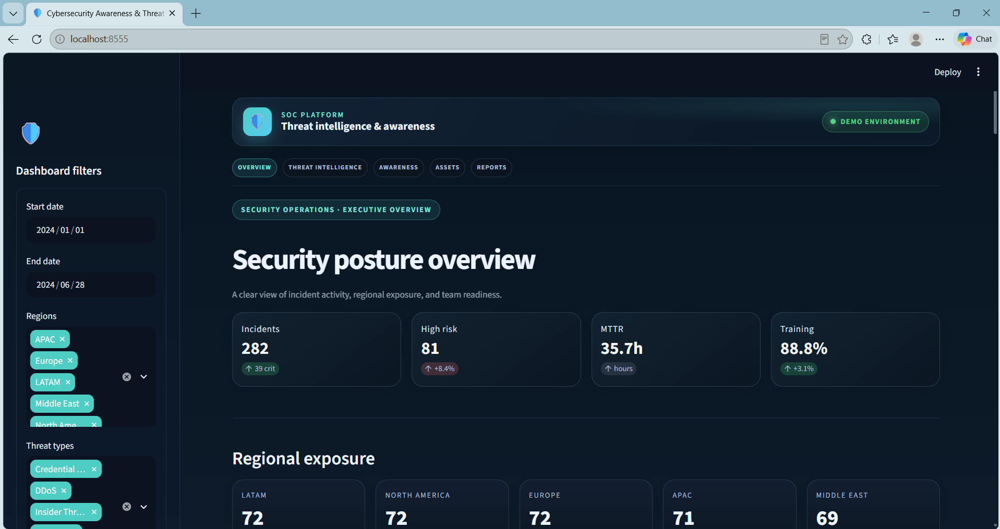
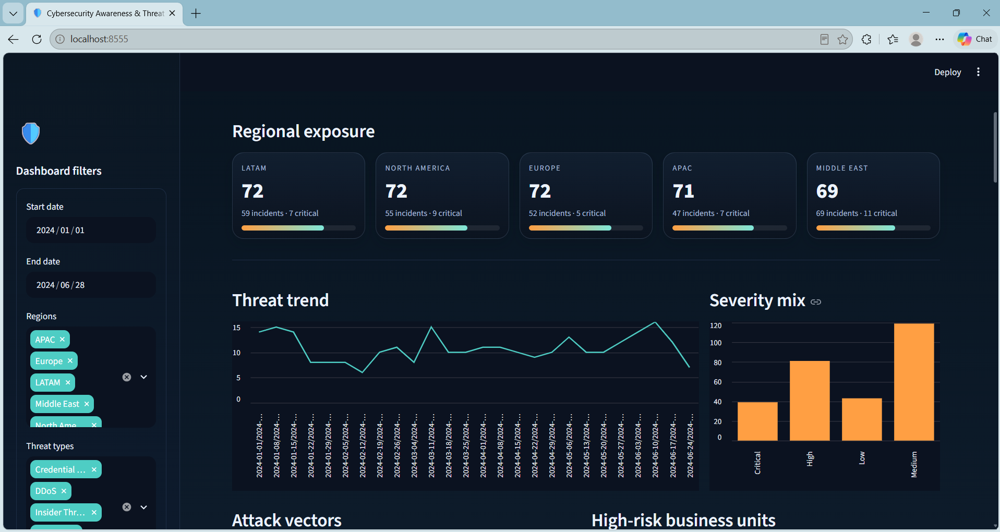
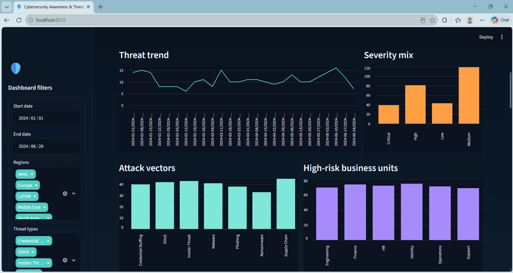
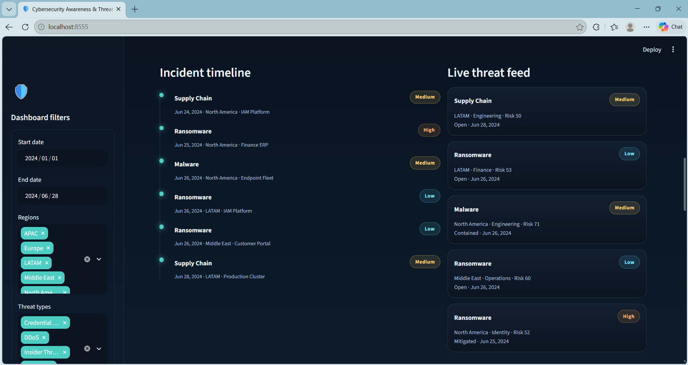
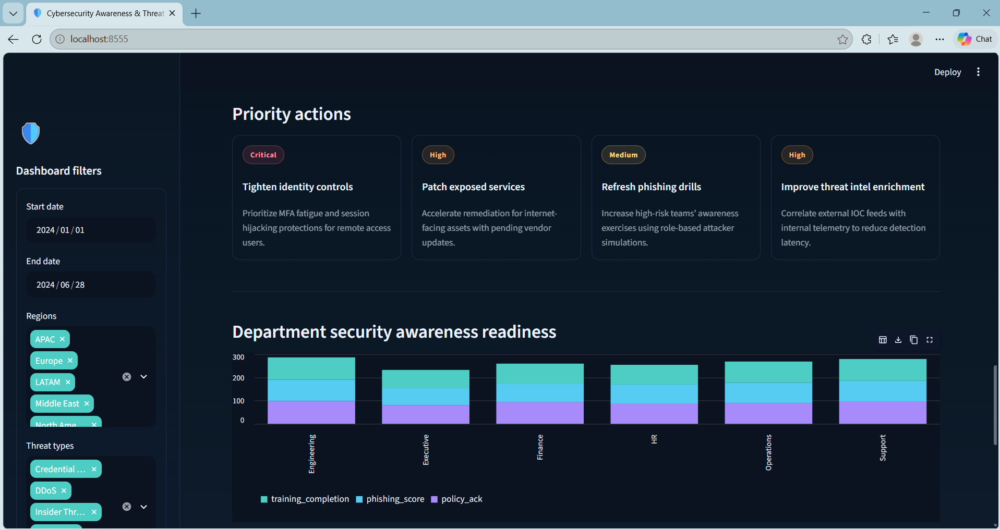
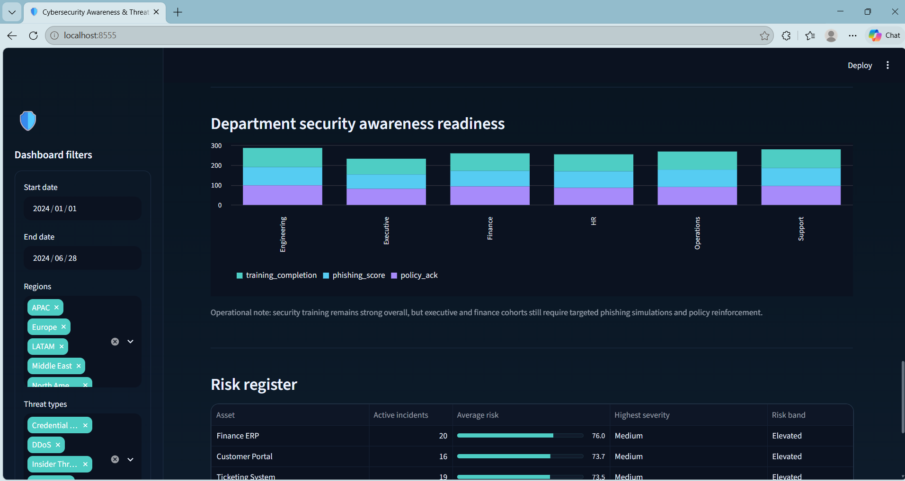
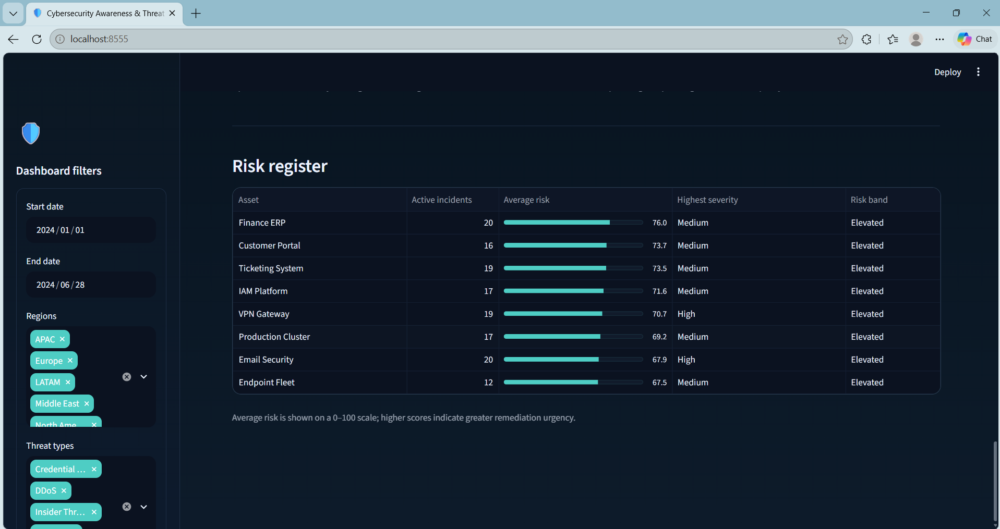

# Cybersecurity Awareness & Threat Intelligence Dashboard

A defensive, educational Streamlit dashboard for exploring synthetic incident activity, regional risk, and security-awareness indicators.

> **Demo project:** The incidents, awareness measurements, threat feed, and recommendations are sample/demo data. The dashboard does not connect to live threat-intelligence sources, monitor production systems, or provide real security alerts.

## Author

**Adarsh Srivastav**

Cybersecurity student and project developer
[GitHub profile](https://github.com/adarshsrivastav23905)

## Overview

This project presents a security-operations-style view of incident and awareness data. Use the sidebar filters to explore incidents by date range, region, threat type, and minimum risk score. The dashboard updates its incident-focused metrics and visualizations to reflect the selected filters.

The incident sample is generated locally in `app.py` with a fixed random seed. Awareness figures and recommended actions are illustrative values defined in the same file. No backend service, database, external feed, or authentication is required.

## Features

- Executive overview with incident, high-risk, response-time, and training metrics
- Regional exposure tiles with average risk and incident counts
- Weekly incident trend and severity breakdown
- Attack-vector and business-unit risk charts
- Incident timeline and demo threat-feed cards
- Recent incident activity table with severity and status labels
- Prioritized security recommendations
- Department awareness metrics and an asset risk register
- Sidebar filters for date, region, threat type, and minimum risk score
- Dark Streamlit theme and responsive layout

## Dashboard flow

```text
Synthetic incident and awareness data
                  |
                  v
         Sidebar filter controls
                  |
                  v
     Filtered incident calculations
                  |
                  v
  Metrics, charts, timeline, and tables
```

## Technology

| Area | Technology |
|---|---|
| Language | Python |
| Dashboard | Streamlit |
| Data handling | pandas |
| Demo data generation | NumPy |
| Theme configuration | Streamlit `config.toml` |

## Project structure

```text
Cybersecurity-Awareness-Threat-Intelligence-Dashboard/
├── .streamlit/
│   └── config.toml              # Dashboard theme and Streamlit settings
├── screenshots/                 # Captured dashboard and source evidence
│   ├── 01_source_syntax.png
│   ├── 02_dashboard_overview.png
│   ├── 03_regional_exposure.png
│   ├── 04_threat_breakdown.png
│   ├── 05_incident_monitoring.png
│   ├── 06_incident_activity.png
│   ├── 07_priority_actions.png
│   ├── 08_risk_register.png
│   ├── 09_awareness_readiness.png
│   ├── 10_filters_in_actions.png
│   ├── 11_project_structure.png
│   └── 12_filter_logic.png
├── .gitignore                   # Excludes environments, caches, and secrets
├── app.py                       # Dashboard UI, demo data, and filter logic
├── README.md
└── requirements.txt             # Python package requirements
```

The local `.venv/` environment and Python cache files are intentionally excluded from version control.

## Requirements

- Python 3.10 or newer
- pip
- A modern web browser

Python 3.13 is recommended for this project setup.

## Installation and run

Run these commands from the project root.

### Windows PowerShell

```powershell
py -3.13 -m venv .venv
.\.venv\Scripts\python.exe -m pip install -r requirements.txt
.\.venv\Scripts\python.exe -m streamlit run app.py --server.port 8555
```

### macOS or Linux

```bash
python3 -m venv .venv
source .venv/bin/activate
python -m pip install -r requirements.txt
python -m streamlit run app.py --server.port 8555
```

Open the local URL printed by Streamlit, normally [http://localhost:8555](http://localhost:8555).

## Validation

Check that the app has valid Python syntax:

```bash
python -m py_compile app.py
```

This is a syntax check, not an automated test suite. The repository currently does not include automated tests.

## Screenshot gallery

These images document the local demo interface. They are not evidence of real-time monitoring or production threat activity.

### Overview



### Regional exposure



### Threat analytics



### Incident monitoring



### Priority actions



### Awareness readiness



### Risk register



## Security and limitations

- This project is an educational dashboard, not an operational SOC, SIEM, or IDS.
- The displayed incident records are generated synthetic examples, not imported telemetry.
- The threat feed is a presentation of sample records; it is not live or streaming.
- Awareness scores and recommendations are illustrative.
- Risk bands and thresholds are for demonstration and are not validated for production use.
- Do not enter real incident details, credentials, or personal information into screenshots or public project materials.

## Future enhancements

- Add an explicitly configured and authenticated source for authorized threat-intelligence data.
- Separate data generation, presentation, and filtering into testable modules.
- Add automated tests for filtering, aggregations, and empty-result behavior.
- Improve chart semantics and accessibility, including comparative awareness charts.
- Add data-source timestamps and clear freshness indicators if external data is integrated.

## Project status

**Educational local prototype using synthetic data.** It is suitable for demonstration and further development, but has not been validated for production security monitoring.
